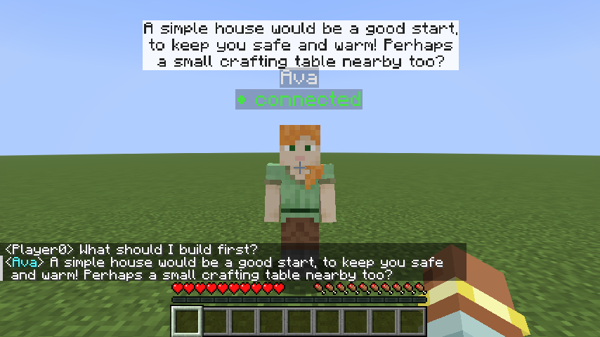

# MC-ECA: Embodied Conversational Agents in Minecraft

MC-ECA turns a Minecraft character into an **embodied conversational agent that you
program in Python**, much like the NAO robot in the course. Your Python script decides
what it says and does. The character can:

* **talk** in a speech bubble, with a "..." bubble while it thinks
* **look** at you or at a spot, **gesture** (nod, shake, wave, crouch, jump) and show
  **emotions** (happy, love, angry, sad, surprised, confused)
* **walk** to you or a place, around obstacles, and **follow** you at a set distance
* **hold**, **give** and **take** items
* **notice** you coming close or leaving, being clicked or punched, and describe its
  **surroundings** (time, weather, animals nearby) for an LLM
* **listen and speak**: hold V to talk to it, and it answers out loud (free local
  speech models, or the course's OpenAI `whisper-1`/`tts-1`)
* **hear other NPCs**: agents notice when another NPC speaks (and whether they were
  addressed), for multi-agent scenes, with a guard against endless back-and-forth
* **log** a pilot-study session to CSV, without usernames




```python
from mceca import NPC

npc = NPC("Ava", skin="alex")

@npc.on_chat                      # a player typed something near Ava
def reply(player, text):
    npc.look_at(player)           # gaze
    npc.say("Hi " + player.name)  # speech bubble + chat
    npc.gesture("nod")            # gesture

npc.run()
```

## How it works

```
 ┌──────────── Minecraft (Java) ────────────┐          ┌──────── your Python script ─────────┐
 │  MC-ECA mod = the BODY                   │  local   │  the BRAIN                          │
 │  • spawns the NPC                        │  socket  │  • @npc.on_chat  receives messages  │
 │  • speech bubble, gaze, gestures         │ ───────► │  • calls an LLM (OpenAI / Ollama)   │
 │  • reports what players say              │ ◄─────── │    or a human (Wizard of Oz)        │
 │                                          │  JSON    │  • npc.say / look_at / gesture ...  │
 └──────────────────────────────────────────┘          └─────────────────────────────────────┘
```

* **You never touch Java.** The mod is installed once like any other Minecraft mod.
* **Nothing happens automatically.** The NPC only looks, nods or talks when your script
  says so, so every behaviour (modality) is under your control, and you can switch
  it on or off for your study.
* **Any LLM works.** The examples use the course OpenAI key (`gpt-5-nano`) or a free
  local model through [Ollama](https://ollama.com).

## Quick start

Full instructions: **[docs/01-install.md](docs/01-install.md)**.

1. Get Minecraft 26.3 with MC-ECA: import **`mc-eca-<version>.mrpack`** from the
   [Releases](../../releases) page in [Prism Launcher](https://prismlauncher.org) or the
   [Modrinth App](https://modrinth.com/app) (one click). Or use the official launcher with
   Fabric, see the install guide.
2. Install the Python library (from this folder):
   ```bash
   python -m venv .venv
   ```
   Activate it (`source .venv/bin/activate` on macOS/Linux, `.venv\Scripts\activate` on Windows), then:
   ```bash
   pip install -e python -r examples/requirements.txt
   ```
3. Start Minecraft, open a world, and run:
   ```bash
   python examples/01_hello.py
   ```
4. Ava appears in front of you. Press **T** and say hi.

## Examples

| File | What it shows |
|------|---------------|
| [`examples/01_hello.py`](examples/01_hello.py) | The basics: react to chat, look, speak, nod. No AI. |
| [`examples/02_openai_agent.py`](examples/02_openai_agent.py) | LLM agent with the course OpenAI key (`gpt-5-nano`) and conversation memory. |
| [`examples/03_ollama_agent.py`](examples/03_ollama_agent.py) | The same agent with a free local model (Ollama): no key, no data leaves the laptop. |
| [`examples/04_wizard_of_oz.py`](examples/04_wizard_of_oz.py) | A human types the NPC's answers (and gestures) for pilot studies. |
| [`examples/05_llm_gestures.py`](examples/05_llm_gestures.py) | Verbal + one more modality: the LLM picks a gesture for every answer. |
| [`examples/06_proactive_greeter.py`](examples/06_proactive_greeter.py) | Non-verbal behaviour without AI: greets you when you come close, idles, accepts gifts. |
| [`examples/07_llm_actions.py`](examples/07_llm_actions.py) | The LLM decides what to say **and do** (JSON): gestures, emotions, come/follow/stop/give, grounded in what Ava perceives. |
| [`examples/08_pilot_study.py`](examples/08_pilot_study.py) | Pilot-study template: two conditions, participant ids, CSV log with response times. |
| [`examples/09_voice_agent.py`](examples/09_voice_agent.py) | Voice: hold V to talk, the NPC answers out loud (offline or OpenAI). |
| [`examples/10_full_agent.py`](examples/10_full_agent.py) | **The all-in-one agent**: voice, perception, LLM decisions (speech, gestures, emotions, walking, items), idle behaviour, logging. A sense → think → act loop. |
| [`examples/11_two_agents.py`](examples/11_two_agents.py) | Two agents that hear each other: a guide hands the player over to a merchant; listeners look at the speaker. |

## Documentation

| For | Document |
|-----|----------|
| Students | [One-page handout](docs/handout.md) |
| | [01 – Install](docs/01-install.md) |
| | [02 – Your first agent (tutorial)](docs/02-your-first-agent.md) |
| | [03 – API reference](docs/03-api-reference.md) (Python + protocol for other languages) |
| | [04 – Troubleshooting & tips](docs/04-troubleshooting.md) |
| | [05 – Pilot studies](docs/05-pilot-studies.md) (conditions, logs, analysis, data rules) |
| | [06 – Voice](docs/06-voice.md) (push-to-talk, speech-to-text, text-to-speech) |
| AI coding assistants | [AGENTS.md](AGENTS.md): give this to your AI assistant (ChatGPT, Copilot, …) |
| TAs / maintainers | [Building the mod](docs/maintainers/building-the-mod.md) |
| | [Development log](docs/maintainers/devlog.md): every step of how this was built, and why |

## Repository layout

```
mc-eca/
├── mod/        the Minecraft mod (Java, Fabric). Students only need the built .jar
├── python/     the `mceca` Python library (standard library only, no dependencies)
├── examples/   ready-to-run agents, start here
├── tools/      test brains for maintainers (python/tests: offline unit tests)
└── docs/       guides, API reference, maintainer notes
```

## Status

Version 0.5.0: text and voice conversations, full body (gaze, gestures, emotions,
walking, items), perception, agents that hear each other, study logging, and a one-click
install pack. Every push is checked automatically (mod build + Python tests on Linux,
macOS and Windows).

See [CHANGELOG.md](CHANGELOG.md).

## License

[MIT](LICENSE). Minecraft is a trademark of Mojang/Microsoft; this project is not
affiliated with them. Every player needs their own copy of Minecraft Java Edition.
