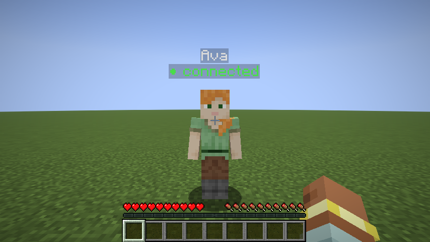
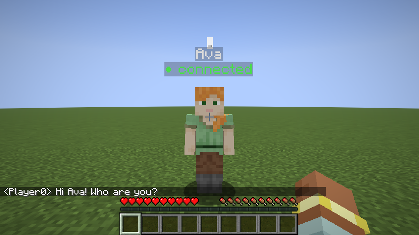

# 01 – Install

This takes about 15 minutes the first time. You need:

* **Minecraft: Java Edition** (one copy per group is enough: the agent runs on one laptop)
* **Python 3.10 or newer** ([python.org/downloads](https://www.python.org/downloads/))
* this repository: on its GitHub page, **Code → Download ZIP** (and unzip it), or `git clone` it
* from the repository's **Releases** page (right side of the GitHub page): the files
  `mc-eca-<version>.mrpack` and `mc-eca-<version>.jar` of the newest release

> The Minecraft and Python parts run **on the same computer**. The script talks to the
> game over a local connection.

---

## Step 1 – Minecraft with MC-ECA

Pick **one** of the two ways. Both give you Minecraft **26.3** with Fabric, Fabric API and
MC-ECA. (The mod only works on exactly 26.3.)

### Way A (recommended): one-click pack in Prism Launcher or the Modrinth App

The pack creates a separate Minecraft *instance* with everything installed, and leaves
your other Minecraft installations alone.

1. Install [Prism Launcher](https://prismlauncher.org) (free, Windows/macOS/Linux) or the
   [Modrinth App](https://modrinth.com/app), and sign in with your Microsoft account
   (the one that owns Minecraft).
2. Import `mc-eca-<version>.mrpack`:
   * **Prism Launcher:** *Add Instance → Import → Browse…* → choose the file → *OK*.
   * **Modrinth App:** *+ (Create an instance) → Import from file* → choose the file.
3. Start the new **MC-ECA** instance.

The pack also turns off *Pause on lost focus*, so the game keeps running while you click
into your terminal or editor.

### Way B: the official Minecraft Launcher

1. Start the official Minecraft Launcher once and log in, then close it.
2. Download the **Fabric installer** from <https://fabricmc.net/use/installer/>
   (Windows: the `.exe`; macOS/Linux: the universal `.jar`). Run it, choose **Client**,
   set **Minecraft Version** to `26.3`, keep the newest **Loader Version**, click **Install**.
   This adds a **fabric-loader-26.3** installation to the launcher.
3. **Give that installation its own folder**, otherwise its mods end up in the same `mods`
   folder as your other Minecraft versions and those stop starting: in the launcher, go to
   *Installations*, hover over **fabric-loader-26.3** → *… → Edit*, and set **Game
   directory** to a new folder, e.g. `minecraft-mceca` in your Documents. *Save*.
4. Start **fabric-loader-26.3** once (*Play*) and close the game again. This creates the
   folder with a `mods` folder inside.
5. Download **Fabric API** for 26.3 from <https://modrinth.com/mod/fabric-api/versions?g=26.3>
   (file like `fabric-api-0.161.0+26.3.jar`). Copy it **and** `mc-eca-<version>.jar` into
   the `mods` folder inside the game directory from step 3.

## Step 2 – Open a world

1. Start the MC-ECA instance (Way A) or the **fabric-loader-26.3** installation (Way B).
2. Click *Singleplayer → Create New World*. For testing we recommend:
   * **Game Mode:** Creative
   * **World Type:** Superflat (under *World*), which is quiet and flat with nothing in the way
3. Open the world.

Check that the mod is running: press **T** and type `/eca status`. You should see:

```
MC-ECA listening on 127.0.0.1:25599, 0 script(s) connected
```

**Tip (Way B):** press **F3 + P** once to turn off *Pause on lost focus*. Otherwise the
game pauses every time you click on your terminal or code editor, and the NPC freezes.

## Step 3 – Install the Python library

Open a terminal **in the repository folder** (the one with this `README.md`):

**macOS / Linux**
```bash
python3 -m venv .venv
```
```bash
source .venv/bin/activate
```
```bash
pip install -e python -r examples/requirements.txt
```

**Windows (PowerShell or Command Prompt)**
```bat
python -m venv .venv
.venv\Scripts\activate
pip install -e python -r examples/requirements.txt
```

Windows notes:
* When installing Python from python.org, tick **"Add python.exe to PATH"** on the first
  screen. If `python` opens the Microsoft Store instead, use `py` (e.g. `py -m venv .venv`).
* If PowerShell says *running scripts is disabled on this system* when activating, run
  this once and try again:
  `Set-ExecutionPolicy -Scope CurrentUser RemoteSigned`
* The first time a script connects, Windows may ask whether to allow Java/Python on the
  network. *Private networks* is enough (the connection never leaves your computer).

* `python -m venv .venv` creates an isolated Python environment for this project
  (do this once).
* `activate` switches your terminal to it. **Do this every time you open a new terminal.**
  You'll see `(.venv)` at the start of the prompt.
* `pip install -e python` installs the `mceca` library; `examples/requirements.txt`
  adds `openai` and `python-dotenv` for the LLM examples.

## Step 4 – Run your first agent

With Minecraft open in a world:

```bash
python examples/01_hello.py
```

The terminal prints:

```
[mceca] connected: spawned Ava
```

and **Ava** appears three blocks in front of you. Press **T** and type `hello`. Ava turns
to you, answers in a speech bubble, and nods.



The line under her name shows whether a script is connected:

* **● connected**: your script is running and receives what you say.
* **○ no brain**: no script is running. Start it again and it reconnects to the same Ava.

Stop the script with **Ctrl + C**. Ava stays in the world. Remove her with `/eca remove Ava`.

## Step 5 – Use an LLM

**Option A: course OpenAI key (fast, needs internet).**
1. Copy `.env.example` to a new file called `.env` (same folder).
2. Paste your group's key after `OPENAI_API_KEY=`.
3. Run `python examples/02_openai_agent.py`.

> Never put the key in your code or on GitHub. `.env` is already excluded from git.

**Option B: Ollama (free, offline, private).**
1. Install Ollama from <https://ollama.com> and start it. It must keep running while you
   use the examples: the Ollama app runs in the menu bar / system tray. With Homebrew on
   macOS, use `brew services start ollama`.
2. Download a model (about 3 GB):
   ```bash
   ollama pull gemma3:4b
   ```
   On an older laptop use `gemma3:1b` (and change `MODEL` in the example).
3. Run `python examples/03_ollama_agent.py`.



## Step 6 (optional) – Voice

To talk to the NPC with your voice (hold **V**) and hear it answer:

```bash
pip install -e "python[voice]"
```

```bash
python examples/09_voice_agent.py
```

The first start downloads the speech models (~200 MB). On macOS, allow the microphone
for your terminal when asked. Details: **[06 – Voice](06-voice.md)**.

Next: **[02 – Your first agent](02-your-first-agent.md)** explains the code so you can
build your own.

Something not working? See **[04 – Troubleshooting](04-troubleshooting.md)**.
