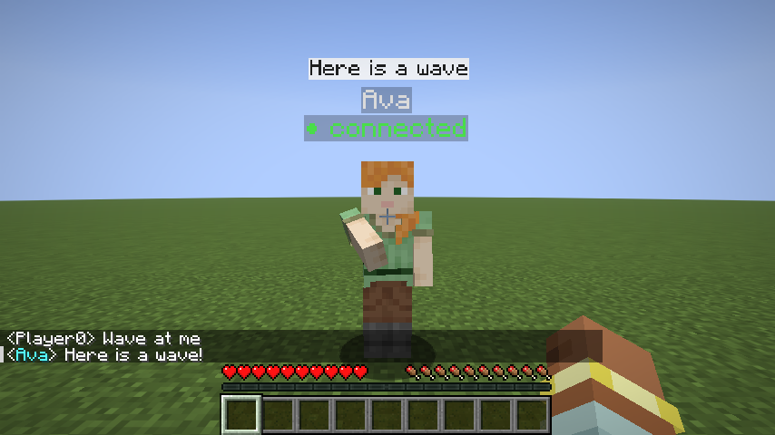
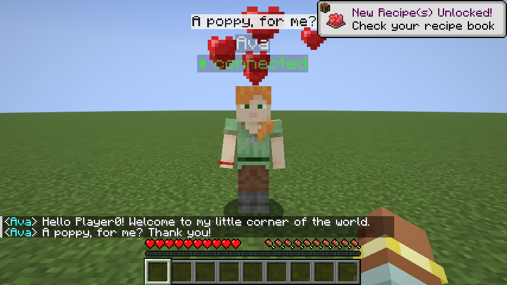
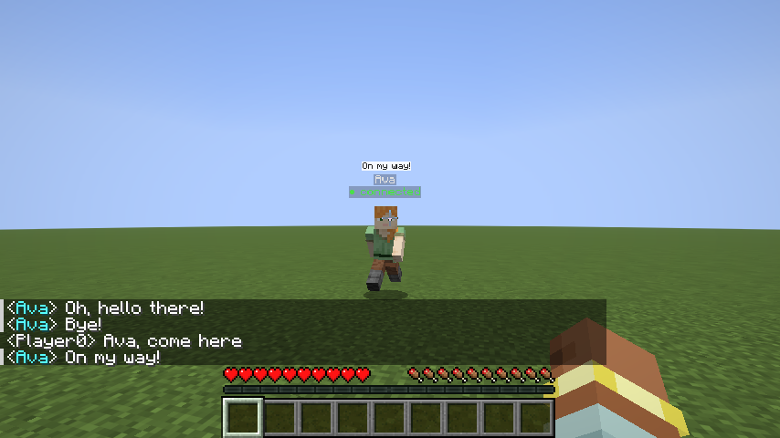
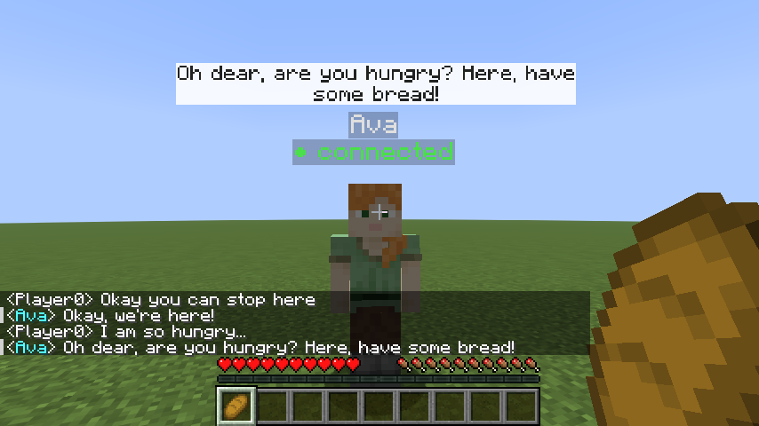
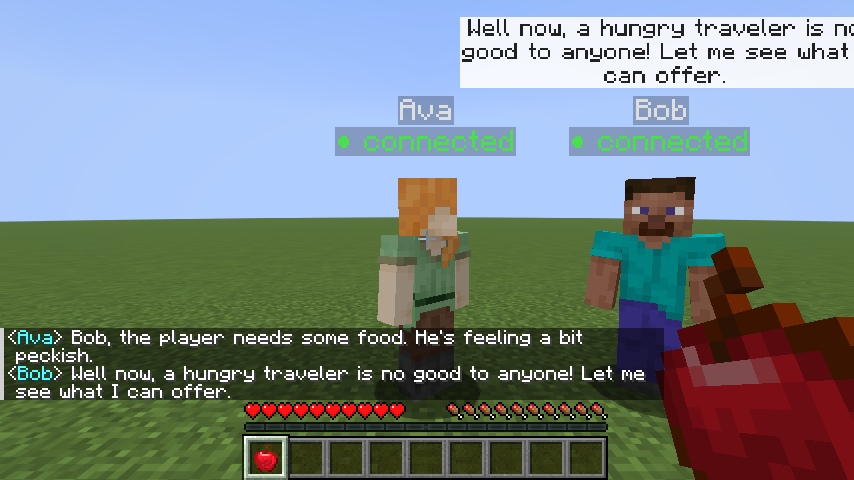

# 02 – Your first agent

This tutorial explains how an MC-ECA script works, step by step, and ends with ideas
for your own project. It assumes you finished [01 – Install](01-install.md). Every
section points to a ready-to-run example in [`examples/`](../examples).

## 1. The three parts of every script

```python
from mceca import NPC

npc = NPC("Ava", skin="alex")          # 1. create (or find) the NPC

@npc.on_chat                           # 2. say what happens when someone talks to it
def reply(player, text):
    npc.look_at(player)
    npc.say("You said: " + text)
    npc.gesture("nod")

npc.run()                              # 3. keep listening until Ctrl+C
```

1. **`NPC("Ava", skin="alex")`** connects to Minecraft. If no world is open yet, it waits.
   If there is no NPC called *Ava* in the world, it spawns one 3 blocks in front of you.
   If Ava already exists (e.g. you restarted the script), it takes control of her again.
2. **`@npc.on_chat`** marks a function that runs every time a player talks to Ava. It
   gets the `player` (with `.name` and `.distance`) and the `text` they typed.
3. **`npc.run()`** waits for messages and calls your function. Nothing after this line runs.

### When is a player "talking to" the NPC?

When they type in the normal chat (press **T**) and either:

* stand within **8 blocks** of the NPC (the nearest NPC hears it), or
* start the message with the NPC's name: `Ava, where is the village?` or `@Ava hi`.

This is the *hearing range*; you can change it in the config file (see the
[API reference](03-api-reference.md#configuration)).

## 2. What the NPC can do

| Call | What you see | Modality |
|------|--------------|----------|
| `npc.say("Hello!")` | speech bubble (typed out letter by letter) + a line in the chat | verbal |
| `npc.thinking(True)` | a small animated `...` bubble; disappears when the NPC speaks | turn-taking cue |
| `npc.look_at(player)` | turns towards the player and keeps following them with its eyes | gaze |
| `npc.look_at((x, y, z))` | looks at a spot ("look over there") | gaze / pointing |
| `npc.gesture("nod")` | `nod`, `shake`, `wave`, `crouch`, `jump` | gesture |
| `npc.emote("happy")` | particles over the head: `happy`, `love`, `angry`, `sad`, `surprised`, `confused` | emotion |
| `npc.walk_to(player)` | walks over to you (around obstacles) | movement / proxemics |
| `npc.follow(player, distance=3)` | follows you at a set distance | movement / proxemics |
| `npc.hold("apple")` | holds an item in its hand | objects |
| `npc.give(player, "bread")` | gives you an item | objects |
| `npc.take(player)` | takes the item from your hand | objects |



**Nothing happens automatically.** If you don't call `look_at`, the NPC doesn't look at
you; if you don't call `thinking`, there is no "..." bubble. That's on purpose: you
decide which behaviours your agent has, so you can compare versions in your study
(e.g. *with* vs *without* gaze).

All calls return immediately. A gesture or emotion takes about one second; a long
sentence takes a few seconds to type out. Full details: [API reference](03-api-reference.md).

## 3. Reacting to more than chat

An embodied agent should notice what you *do*, not only what you type.
[`examples/06_proactive_greeter.py`](../examples/06_proactive_greeter.py) greets you
when you come close, says goodbye when you leave, thanks you for gifts and complains
when punched. No AI is needed.

```python
npc = NPC("Ava", skin="alex", notice_range=6)   # "near" = within 6 blocks

@npc.on_player_near                 # someone walked up to Ava
def greet(player):
    npc.look_at(player)
    npc.gesture("wave")
    npc.say("Hello " + player.name + "!")

@npc.on_player_leave                # ... and walked away again
def goodbye(player):
    npc.say("Goodbye!")
    npc.look_at(None)

@npc.on_click                       # right-click; item = what the player holds, or None
def clicked(player, item):
    if item:
        npc.take(player)            # Ava now holds it
        npc.emote("love")
        npc.say("For me? Thank you!")

@npc.on_hit                         # left-click / punch
def hit(player):
    npc.emote("angry")
```



All events: `on_chat`, `on_player_near`, `on_player_leave`, `on_click`, `on_hit`,
`on_arrive` (a `walk_to` reached its goal) and `on_stuck` (it couldn't).

## 4. Walking and personal space

```python
npc.walk_to(player)                 # come here (stops 3 blocks away)
npc.walk_to((10, 64, -3))           # go to a position (press F3 in-game to see coordinates)
npc.follow(player, distance=3)      # stay about 3 blocks from the player
npc.stop()

@npc.on_arrive
def arrived():
    npc.say("Here I am!")
```



The NPC uses Minecraft's own pathfinding, so it walks around walls and up single-block
steps. It can't open doors or climb ladders. The `distance` in `follow` and `walk_to`
lets you study **proxemics**: how close should an agent come?

## 5. Adding an LLM

Open [`examples/02_openai_agent.py`](../examples/02_openai_agent.py) (course key) or
[`examples/03_ollama_agent.py`](../examples/03_ollama_agent.py) (local). Both are the
same apart from the first lines; Ollama speaks the same API as OpenAI.

```python
client = OpenAI()          # Ollama: OpenAI(base_url="http://localhost:11434/v1", api_key="ollama")
MODEL = "gpt-5-nano"       # Ollama: "gemma3:4b"

PERSONA = """You are Ava, a friendly guide who lives in this Minecraft world.
...
Keep it to one or two short sentences."""
```

**The persona** is the system prompt: who the agent is and how it should answer. Keep
answers short: long text makes huge speech bubbles. If your model adds things like
`*smiles*` or `[Speech]`, tell it explicitly not to (see the persona in the examples).

```python
histories = {}  # player name -> list of messages

@npc.on_chat
def reply(player, text):
    npc.look_at(player)
    npc.thinking(True)                                   # show "..." while waiting

    history = histories.setdefault(player.name, [])     # this player's conversation
    history.append({"role": "user", "content": text})
    messages = [{"role": "system", "content": PERSONA}] + history[-2 * MAX_TURNS:]

    response = client.chat.completions.create(model=MODEL, messages=messages, ...)
    answer = response.choices[0].message.content.strip()

    history.append({"role": "assistant", "content": answer})
    npc.say(answer)                                       # also hides the "..." bubble
```

**Memory:** LLMs remember nothing by themselves. Every call sends the system prompt plus
the last `MAX_TURNS` exchanges with this player. That history lives in your script, so it
is lost when you restart the script.

**One message at a time:** while your function waits for the LLM, new chat messages
wait in line and are handled one after another. Players can't interrupt the NPC.

## 6. Verbal + one more modality: let the LLM choose a gesture

[`examples/05_llm_gestures.py`](../examples/05_llm_gestures.py) asks the model to start
every answer with a gesture tag:

```
[wave] Welcome to my corner of the world!
[nod] Yes, follow the path to the south.
```

The script cuts the tag off, plays the gesture and says the rest:

```python
TAG = re.compile(r"^\s*\[(\w+)\]\s*")

match = TAG.match(answer)
if match:
    gesture = match.group(1).lower()     # "wave"
    answer = answer[match.end():]        # "Welcome to my corner of the world!"
if gesture in GESTURES:
    npc.gesture(gesture)
npc.say(answer)
```

Small models don't always choose well. In our test, `gemma3:4b` answered
*"Absolutely not, the Nether is very dangerous"* with **crouch** instead of
**shake**. Whether the non-verbal behaviour fits the words is exactly the kind of thing
a pilot study can evaluate.

## 7. Let the LLM *act*: structured output + perception

[`examples/07_llm_actions.py`](../examples/07_llm_actions.py) goes further. Every turn
the model gets what Ava perceives, and must answer with a **JSON object**:

```python
def system_prompt():
    return f"""You are Ava, a friendly and helpful villager in a Minecraft world.
What you perceive right now: {npc.describe_surroundings()}
Answer ONLY with a JSON object with exactly these keys:
  "say", "gesture" (one of nod, shake, ...), "emotion" (happy, ...),
  "action" (none, come, follow, stop, give_bread)"""

response = client.chat.completions.create(
    model=MODEL, messages=messages,
    response_format={"type": "json_object"},   # the model must return valid JSON
)
decision = json.loads(response.choices[0].message.content)
# {"say": "Oh dear, here, have some bread!", "gesture": "nod", "emotion": "love", "action": "give_bread"}
```

`describe_surroundings()` produces sentences like *"It is 00:00 (night), the weather is
clear and you are in a plains area. There is 1 player near you: one 3 blocks away
holding a diamond. Animals and monsters nearby: a cow (4 blocks)."* so the agent can
talk about the world it is in. The script then maps each field to a call (`npc.say`,
`npc.gesture`, `npc.emote`, `npc.walk_to`, `npc.follow`, `npc.give`, …).



In our test the local model chose `come`, `follow`, `stop` and `give_bread` at the right
moments. It sometimes wrote an action name into the `gesture` field. The script ignores
values it doesn't know, which is why you should always check what the model returns.

## 8. Idle behaviour with timers

Real characters don't freeze between conversations. Timers run code regularly:

```python
import random, mceca

@mceca.every(6)                       # every 6 seconds
def idle():
    x, y, z = npc.position()
    npc.look_at((x + random.uniform(-6, 6), y + 1.5, z + random.uniform(-6, 6)))

mceca.after(30, lambda: npc.say("Is anyone there?"))   # once, after 30 seconds
```

Timers run between events, never at the same time as a handler.

## 9. Wizard of Oz

[`examples/04_wizard_of_oz.py`](../examples/04_wizard_of_oz.py) lets a person type the
NPC's answers in the terminal (`/nod Sure, follow me!` = nod + say). Use it to test an
interaction design before the AI works, or as a human baseline.

> Typing in the terminal takes focus away from Minecraft. Turn off *Pause on lost focus*
> (**F3 + P**) or the game freezes while the wizard types. For a real study, put the wizard
> on a second laptop (see [Troubleshooting → Wizard of Oz on two laptops](04-troubleshooting.md#wizard-of-oz-on-two-laptops)).

## 10. Several agents that hear each other

Create several NPCs in one script and start them all with `mceca.run()`. Players talk to
the nearest one, or address one by name (`Bob, hello`).

NPCs also **hear each other**: when an NPC says something, every other NPC within
hearing range gets `on_npc_say`:

```python
import mceca
from mceca import NPC

ava = NPC("Ava", skin="alex")
bob = NPC("Bob", skin="steve")

@bob.on_npc_say
def bob_hears(speaker, text):        # speaker.name == "Ava", speaker.addressed == True for "Bob, ..."
    bob.look_at(speaker)             # look at whoever is talking (multi-party gaze)
    if speaker.addressed:
        bob.say("Sure, Ava! Hello traveller, what do you need?")

@ava.on_chat
def ava_reply(player, text):
    ava.say("Bob, could you help this traveller?")    # Bob hears this

mceca.run()
```



* `speaker.addressed` is `True` when the sentence starts with the listener's name. Answering
  only when addressed is a simple, robust turn-taking rule.
* **Loop guard:** if two NPCs answer each other, they would talk forever. Each NPC
  ignores `on_npc_say` after `max_npc_turns` NPC-to-NPC replies in a row (default 3,
  `NPC("Bob", max_npc_turns=2)`). A player message or a timer starts a new count. This
  also works when the NPCs are controlled by **different scripts** (e.g. two groups in
  one world).
* [`examples/11_two_agents.py`](../examples/11_two_agents.py): a guide (Ava) hands the
  player over to a merchant (Bob), both LLM-driven. In our test: *"Ava, I'm really
  hungry"* → Ava: *"Bob, the player needs some food."* → Bob answered the player and gave
  them an apple, while Ava turned to look at Bob.

Multi-party interaction (who speaks when, who is addressed, where the agents look) is a
research topic of its own, and a possible pilot study.

## 11. The all-in-one agent

[`examples/10_full_agent.py`](../examples/10_full_agent.py) combines everything in one
character, around one loop you can reuse:

```
 event ──► observation ("The player walks up to you.") ──► think(): LLM ──► decision (JSON) ──► act()
```

* **Sense:** every event becomes a sentence: `on_chat` → *The player says: "…"*,
  `on_player_near` → *The player walks up to you.*, `on_click` with an item → *The player
  holds out a poppy to give to you.*, `on_hit` → *The player punched you!*, `on_npc_say`
  when addressed → *Bob, another villager, says to you: "…"*.
* **Think:** the LLM gets the persona, `describe_surroundings()`, the conversation so far
  and the observation, and returns `{"say", "gesture", "emotion", "action", "item"}`.
* **Act:** `act()` checks every value (LLMs make mistakes) and calls `say`, `gesture`,
  `emote`, `walk_to`, `follow`, `stop`, `give`, `take`.

In our test with the free local model, Ava waved when the player arrived, described
the area, walked over when asked by voice, gave an apple to the hungry player, accepted
a poppy ("Oh, how lovely!"), got angry and shook her head when punched, and mentioned
the dark at midnight. Use it as a demo, or as a starting point that you cut down to the
one modality your study needs.

## 12. Voice

```python
from mceca import NPC, Voice

npc = NPC("Ava", voice=Voice())     # free and offline; Voice(stt="openai", tts="openai") with the course key

@npc.on_chat                        # typed AND spoken messages
def reply(player, text):
    if player.spoke:                # True when it came from push-to-talk
        ...
    npc.say("I heard you!")         # bubble + spoken out loud
```

Players hold **V** near the NPC while they speak. See **[06 – Voice](06-voice.md)** and
[`examples/09_voice_agent.py`](../examples/09_voice_agent.py).


## 13. Logging a pilot study

```python
from mceca import NPC, StudyLog

log = StudyLog(participant="P01", condition="expressive")
npc = NPC("Ava", log=log, show_status=False)
```

Everything Ava hears and does is written to a CSV file in `logs/`, with response
times and **without Minecraft usernames**.
[`examples/08_pilot_study.py`](../examples/08_pilot_study.py) is a complete session
template with two conditions. See **[05 – Pilot studies](05-pilot-studies.md)**.

## 14. Ideas for your project

* **Persona:** a shopkeeper (`give`/`take` as payment), a museum guide that walks you
  around (`walk_to`), a tutor teaching how to craft, a nervous villager who needs help…
* **Skin:** `skin="noor"` (built-in: `steve alex ari efe kai makena noor sunny zuri`) or
  any Minecraft username, e.g. `skin="Notch"`.
* **Hide the labels** for a study, so participants don't see the name or "● connected":
  `NPC("Ava", show_name=False, show_status=False)`.
* **Compare conditions:** gaze vs. no gaze, thinking bubble vs. none, LLM-chosen vs.
  random gestures, approaching (`walk_to`) vs. waiting, follow distance 2 vs. 5, …

## Using AI to write your code

You may use AI assistants. Give them [`AGENTS.md`](../AGENTS.md): it describes the
library in a form AI assistants such as ChatGPT or Copilot can follow, including the rules (no API keys
in code, no personal data in logs).

## Data and privacy (course rules)

* Don't store personal data of participants. Minecraft usernames count. `StudyLog`
  replaces them with participant ids. If you write your own logs, do the same.
* Delete collected data when the course ends.
* The OpenAI examples send what players type to OpenAI. The Ollama examples keep
  everything on the laptop.
