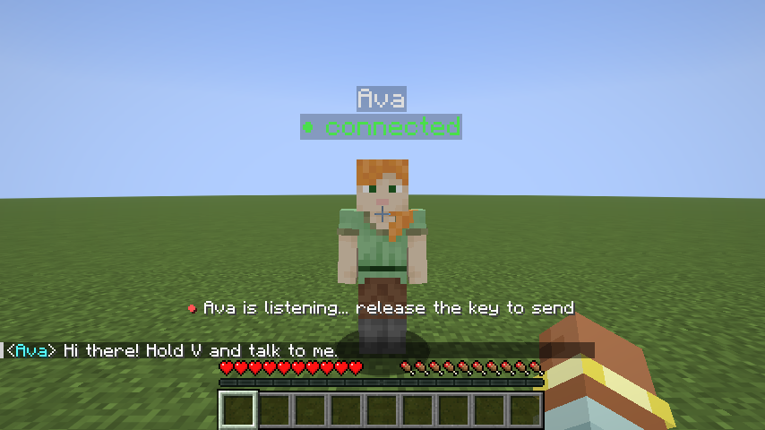
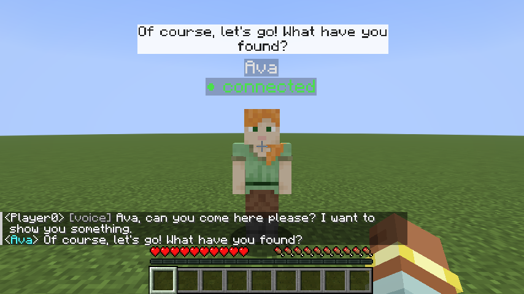

# 06 – Voice

Talk to the NPC with your voice and hear it answer: **hold V** near the NPC while you
speak, let go, and the NPC answers out loud.



## How it works

```
 hold V ─► Minecraft tells your script "start listening"  ─► script records the microphone
 let go ─► "stop listening" ─► speech-to-text ─► your @npc.on_chat(player, text)   (player.spoke == True)
                                                         │
                     npc.say("...") ◄────────────────────┘   bubble + text-to-speech out loud
```

* The audio never goes through Minecraft. Your script records the microphone of the
  laptop it runs on, which is why Minecraft and the script must run **on the same
  computer**.
* Spoken messages arrive in **the same `on_chat` handler** as typed ones, so every
  agent you already wrote understands voice. `player.spoke` tells you which it was.
* What was understood appears in the chat as `<you> [voice] ...`, so you (and
  participants) can see what the agent "heard".
* With a voice, `npc.say()` also speaks out loud. `npc.say(text, speak=False)` only writes.
* When you start talking, the NPC stops speaking (barge-in). Turn this off with
  `Voice(interruptible=False)`.
* Sentences are queued: if an NPC says two things in a row, or two NPCs talk one after
  the other, you hear them one after another, not on top of each other.
* All sound-device work runs on one background thread, so a slow or stuck microphone
  can never freeze your agent or its connection to Minecraft.



## Setup

1. Install the speech packages (once, a few hundred MB):
   ```bash
   pip install -e "python[voice]"
   ```
2. Use a voice in your script:
   ```python
   from mceca import NPC, Voice

   npc = NPC("Ava", voice=Voice())          # free and offline (default)
   ```
3. Run [`examples/09_voice_agent.py`](../examples/09_voice_agent.py), walk to Ava, hold **V**
   and speak.

The **first start downloads** the speech models (Whisper ~150 MB, the voice ~60 MB) into
`~/.cache` (Windows: `C:\Users\<you>\.cache`). After that, local voice works offline.

**macOS:** the first time, macOS asks whether your terminal (or VS Code / PyCharm) may
use the microphone. Say yes. If you said no: System Settings → Privacy & Security →
Microphone → switch your terminal on, then restart it.

**Change the key:** Options → Controls → Key Binds → *MC-ECA* → *Talk to NPC (hold)*.

## Local or OpenAI?

| | `"local"` (default) | `"openai"` (course key) |
|---|---|---|
| Speech-to-text | faster-whisper (Whisper on your laptop) | `whisper-1` |
| Text-to-speech | Piper (neural voice on your laptop) | `tts-1` |
| Cost / key | free, no key | uses the group's key |
| Privacy | audio never leaves the laptop | audio/text sent to OpenAI |
| Speed (MacBook M4, measured) | 3 s of speech → text in 0.7 s; a sentence → audio in 0.4 s | depends on the internet |
| Quality | good for clear English; slower/less accurate on old laptops | very good, many languages |

```python
Voice()                                               # local + local
Voice(stt="openai", tts="openai", openai_voice="nova") # course key (load .env first)
Voice(stt="local", tts=None)                           # listens, answers only in text
```

All options:

| Option | Default | |
|--------|---------|---|
| `stt` | `"local"` | `"local"`, `"openai"` or `None` |
| `tts` | `"local"` | `"local"`, `"openai"` or `None` |
| `language` | `"en"` | language spoken by players (`"nl"`, `"de"`, …); `None` = detect |
| `whisper_model` | `"base"` | local Whisper size: `"tiny"` (fastest), `"base"`, `"small"` (more accurate, slower) |
| `piper_voice` | `"en_US-lessac-medium"` | local voice, e.g. `en_US-amy-medium`, `en_GB-alba-medium`, `nl_NL-mls-medium` ([all voices](https://huggingface.co/rhasspy/piper-voices/tree/main)) |
| `openai_voice` | `"alloy"` | `alloy`, `echo`, `fable`, `onyx`, `nova`, `shimmer` |
| `openai_client` | new `OpenAI()` | your own client |
| `interruptible` | `True` | the player talking stops the NPC's speech |
| `volume` | `1.0` | loudness of the NPC's voice |
| `input_device`, `output_device` | system default | microphone / speaker (number or name from `python -m sounddevice`) |

## Voice as a modality in your study

Voice changes the interaction a lot, which makes it a good study variable:

* **Typed vs. spoken input:** `player.spoke` tells you which one a participant used;
  the [`StudyLog`](05-pilot-studies.md) records it (`{"voice": true, "stt_seconds": 0.7}`).
* **Spoken vs. written answers:** `say(text, speak=condition["voice"])`.
* **Voice character:** different `piper_voice` / `openai_voice` per condition.
* **Latency:** the log has `stt_seconds` (speech-to-text) and `tts_seconds`
  (text-to-speech) next to the `response_time`.
* **Barge-in:** `interruptible=True` vs `False`.

Remember that the voice comes out of the **laptop speakers**, not from the NPC's position
in the world (it's not 3D sound). Use headphones in noisy rooms. Also, the microphone
only records while V is held, so the NPC won't hear its own voice.

## Troubleshooting voice

| Problem | Fix |
|---------|-----|
| Holding V does nothing | Stand within 8 blocks of the NPC. The action bar must say "Ava is listening…". If it says *"can't hear voice"*, create the NPC with `voice=Voice()`. |
| "the microphone only recorded silence" in the terminal | Microphone permission (macOS, see above), or the wrong microphone: list devices with `python -m sounddevice` and pass `Voice(input_device=...)`. |
| "didn't catch that" | Hold V *while* speaking and release after the last word; speak a bit closer to the mic. Very short presses (< 0.3 s) are ignored. |
| Wrong words | Set `language` to the language you speak; use `whisper_model="small"`; or OpenAI `stt`. |
| No sound from the NPC | Check the volume and the output device (`python -m sounddevice`). |
| "the audio device is not responding" | Usually a microphone that disappeared or switched, e.g. an iPhone used as Mac microphone (Continuity). Pick a fixed one: `Voice(input_device="MacBook Pro Microphone")` (names from `python -m sounddevice`). |
| First start takes long | The models are downloading (once). |
| `Voice needs the package ...` | `pip install -e "python[voice]"` in your activated virtual environment. |
